# MartMinds

## Features

### Customer Features

- **User Authentication** - Register and login with secure credentials
- **Profile Management** - View profile, update addresses, and manage account information
- **Address Management** - Add, view, and select delivery addresses during checkout
- **Product Browsing** - View available products with detailed information, categories, and pricing
- **Shopping Cart** - Add multiple items with quantity management and exit support
- **Order Management** - Create orders, track history, and view order status
- **Payment Processing** - Multiple payment methods:
  - Cash payment at delivery
  - Credit card (with validation for card number, holder, expiry, CVV)
  - E-Wallet (with citizen ID validation)
- **Balance Management** - Top-up account balance with minimum transaction validation
- **Mystery Box** - Input a budget amount and get randomly selected products with 10% discount (can be multiple items)

### Driver Features

- **Driver Registration** - Register as a driver through the registration system
- **Order Acceptance** - View and accept available orders for delivery
- **Delivery Tracking** - Manage active deliveries and update delivery status
- **Status Management** - Update orders to "Out for Delivery" or "Delivered"
- **Profile Access** - View driver profile and manage personal information
- **Optional Address** - Drivers can optionally provide address during registration

### Admin Features

- **Product Management** - Add, update, delete, and view products with category management
- **Order Monitoring** - View all customer orders and track order history
- **User Management** - View all registered users with role-based filtering
- **Store Management** - Manage store information and inventory
- **Report Generation** - Generate sales reports and order summaries
- **Inventory Control** - Monitor and manage product stock levels

### System Features

- **Session Management** - Secure login sessions with role-based access control (Customer, Driver, Admin)
- **Exception Handling** - Custom exceptions for payment, orders, stock, and authorization
- **Data Validation** - Comprehensive input validation with format examples:
  - Email validation with format hints
  - Phone number validation (format: 08xxxxxxxxxx)
  - Credit card validation (16 digits with example)
  - CVV validation (3 digits)
  - Citizen ID validation (16 digits)
  - Password strength requirements (min 6 characters)
  - Product ID and quantity validation
- **File Persistence** - CSV-based data storage for all entities:
  - User accounts and profiles
  - Products
  - Orders and order items
  - Payments
- **Exit Support** - Type 'exit' to cancel operations at input prompts
- **Error Handling** - Validation loops with detailed error messages
- **Singleton Pattern** - Efficient service management across the application
- **MVC Architecture** - Clean separation of concerns (Model, View, Service)

## How to Run

### Prerequisites

- Java 11 or higher installed
- Windows, macOS, or Linux

### Build & Run (In Terminal)

1. **Navigate to project directory:**

   ```bash
   cd path/to/MartMinds
   ```

2. **Compile the project:**

   ```bash
   javac -d bin src/com/martminds/**/*.java src/module-info.java
   ```

3. **Run the application:**
   ```bash
   java -cp bin com.martminds.Main
   ```

## Data Files

The application uses CSV files for persistent data storage located in the `data/` directory:

- `users.csv` - User accounts and profiles
- `products.csv` - Product catalog with pricing and stock
- `orders.csv` - Order records with status and delivery info
- `order_items.csv` - Individual items in each order
- `payments.csv` - Payment transaction history

All data is automatically loaded on startup and saved after every transaction.

## User Roles & Test Credentials

### Admin Account

- Email: `admin@mail.com`
- Password: `admin123`
- Full access to all admin features

### Customer Accounts

- **Customer 1:**
  - Email: `cust1@mail.com`
  - Password: `cust123`
- **Customer 2:**
  - Email: `cust2@mail.com`
  - Password: `cust234`

### Driver Accounts

- **Driver 1:**
  - Email: `driver1@mail.com`
  - Password: `driver123`
- **Driver 2:**
  - Email: `driver2@mail.com`
  - Password: `driver234`

## Input Validation Examples

The application provides detailed validation prompts with format requirements and examples:

**Login/Registration:**

- Email: `user@mail.com` (valid email format)
- Password: `SecurePass123` (min 6 characters)
- Phone: `08xxxxxxxxxx` (10-13 digits, format required)

**Payment Details:**

- Credit Card: `4532123456789012` (16 digits)
- Card Holder: `John Doe` (as it appears on card)
- Expiry: `12/25` (MM/YY format)
- CVV: `123` (3 digits on back of card)
- Citizen ID: `3201234567890123` (16 digits)

**Shopping:**

- Product ID: `P001`, `P002` (format: P###)
- Quantity: `1`, `5`, `10` (min 1)
- Mystery Box Budget: `50000`, `100000` (min Rp 10,000)

**Driver Operations:**

- Order ID: `ORD001`, `ORD002` (format: ORD###)
- Status Options: `1` (Out for Delivery), `2` (Delivered), `3` (Cancel)

**Exit Support:**

- Type `exit` at any input prompt to cancel the current operation

## Class Diagram

### Simplified (Models Only)


### Complete

```mermaid
classDiagram
    class Category {
        <<enumeration>>
        APPAREL
        ACCESSORIES
        ELECTRONICS
        BOOKS
        HOME_GARDEN
        SPORTS_OUTDOORS
        TOYS_GAMES
        BEAUTY_PERSONAL_CARE
        FOOD_BEVERAGES
        MUSIC_ENTERTAINMENT
        +getDisplayName() String
        +fromDisplayName(String) Category
        +fromNumber(int) Category
        +toString() String
    }

    class UserRole {
        <<enumeration>>
        ADMIN
        CUSTOMER
        DRIVER
    }

    class PaymentMethod {
        <<enumeration>>
        CASH
        CREDIT_CARD
        EWALLET
    }

    class PaymentStatus {
        <<enumeration>>
        PENDING
        SUCCESS
        FAILED
        CANCELLED
        REFUNDED
    }

    class OrderStatus {
        <<enumeration>>
        PENDING
        CONFIRMED
        PREPARING
        READY_FOR_PICKUP
        OUT_FOR_DELIVERY
        DELIVERED
        CANCELLED
    }


    class Address {
        -String street
        -String city
        -String postalCode
        -String district
        -String province
        +getFullAddress() String
        +isComplete() boolean
        +toString() String
    }

    class User {
        <<abstract>>
        -String userId
        -String name
        -String email
        -String password
        -String phone
        -double balance
        -UserRole role
        -Address address
        +login(email, password) boolean
        +updateProfile(name, phone) void
        +getAddress() Address
        +setAddress(Address) void
        +addFunds(amount) void
        +withdrawFunds(amount) boolean
    }

    class Customer~User~ {
        +addMysteryBoxOrder(orderId) void
    }

    class Admin~User~ {
    }

    class Driver~User~ {
        -boolean isAvailable
        -List~String~ deliveryHistory
        -double latitude
        -double longitude
        +acceptOrder(orderId) void
        +updateDeliveryStatus(orderId, status) void
        +updateLocation(lat, long) void
    }

    class Product {
        -String productId
        -String name
        -double price
        -int stock
        -String description
        -String storeId
        -String category
        +updateStock(quantity) void
        +isAvailable() boolean
        +toString() String
    }

    class Store {
        -String storeId
        -String name
        -Address address
        -String contactNumber
        -double rating
        -long totalRate
        +addRating(newRating) void
        +toString() String
    }

    class MysteryBox {
        -String boxId
        -String name
        -double price
        -String category
        -String description
        -int availableStock
        -String storeId
        -List~Product~ possibleProducts
        +addPossibleProduct(Product) void
        +getPossibleProduct(index) Product
        +isAvailable() boolean
        +updateStock(quantity) void
    }

    class OrderItem {
        -String orderItemId
        -String productId
        -String productName
        -int quantity
        -double priceAtPurchase
        +calculateSubtotal() double
        +increaseQuantity(amount) void
        +decreaseQuantity(amount) void
    }

    class Order {
        -String orderId
        -String customerId
        -String storeId
        -String driverId
        -double totalPrice
        -Address deliveryAddress
        -List~OrderItem~ items
        -OrderStatus status
        -LocalDateTime createdAt
        -LocalDateTime lastUpdatedAt
        +addItem(OrderItem) void
        +removeItem(itemId) void
        +calculateTotal() void
        +updateStatus(OrderStatus) void
        +assignDriver(driverId) void
        +cancel() void
    }

    class MysteryBoxOrder {
        -String boxOrderId
        -String customerId
        -String boxId
        -String boxName
        -double price
        -OrderStatus status
        -String driverId
        -Address deliveryAddress
        -List~Product~ actualContents
        -boolean contentsRevealed
        -LocalDateTime createdAt
        +setActualContents(products) void
        +revealContents() List~Product~
    }

    class Payment {
        <<abstract>>
        -String paymentId
        -String userId
        -String orderId
        -double amount
        -PaymentMethod method
        -PaymentStatus status
        -LocalDateTime createdAt
        -LocalDateTime lastUpdatedAt
        +processPayment()* boolean
        +refund() boolean
        +validateAmount() boolean
        +updateStatus(PaymentStatus) void
        +getStatus() PaymentStatus
        +setStatus(PaymentStatus) void
    }

    class CashPayment~Payment~ {
        -String citizenId
        -double receivedAmount
        -double changeAmount
        +calculateChange() double
        +maskCitizenId() String
        +processPayment() boolean
        +toString() String
    }

    class CreditCardPayment~Payment~ {
        -String cardNumber
        -String cardHolder
        -String expiry
        -String cvv
        +maskCardNumber() String
        +processPayment() boolean
        +toString() String
    }

    class EWalletPayment~Payment~ {
        -String walletId
        -String walletProvider
        +processPayment() boolean
        +refund() boolean        +toString() String    }


    class UserService {
        -static UserService instance
        -List~User~ users
        +getInstance() UserService
        +findUserById(id) User
        +findUserByEmail(email) User
        +getAllUsers() List~User~
        +authenticate(email, password) User
        +registerUser(user) void
        +updateUserAddress(userId, address) void
        +updateUserBalance(userId, amount) void
    }

    class ProductService {
        -static ProductService instance
        -List~Product~ products
        +getInstance() ProductService
        +getProductById(id) Product
        +getAllProducts() List~Product~
        +addProduct(product) void
        +deleteProduct(id) void
        +updateProductStock(productId, quantity) void
    }

    class OrderService {
        -static OrderService instance
        -List~Order~ orders
        +getInstance() OrderService
        +getAllOrders() List~Order~
        +findOrderById(id) Order
        +getOrdersByCustomer(customerId) List~Order~
        +createOrder(order) void
        +updateOrderStatus(orderId, status) void
    }

    class MysteryBoxService {
        -static MysteryBoxService instance
        -List~MysteryBox~ mysteryBoxes
        -List~MysteryBoxOrder~ mysteryBoxOrders
        +getInstance() MysteryBoxService
        +getAllMysteryBoxes() List~MysteryBox~
        +getMysteryBoxById(id) MysteryBox
        +createMysteryBoxOrder(customerId, boxId, address) MysteryBoxOrder
        +getMysteryBoxOrdersByCustomer(customerId) List~MysteryBoxOrder~
    }

    class DriverService {
        -static DriverService instance
        -UserService userService
        +getInstance() DriverService
        +getAllDrivers() List~Driver~
        +getAvailableDrivers() List~Driver~
        +getDriverDeliveries(driverId) List~Order~
        +autoAssignDriver(orderId) boolean
    }

    class PaymentService {
        -static PaymentService instance
        -List~Payment~ payments
        +getInstance() PaymentService
        +createPayment(userId, orderId, amount, method, details) Payment
        +processPayment(paymentId) boolean
        +refundPayment(paymentId) boolean
        +getPaymentById(id) Payment
        +getPaymentsByUserId(userId) List~Payment~
        +getPaymentsByOrderId(orderId) List~Payment~
        +getAllPayments() List~Payment~
    }


    class AuthController {
        +register(id, name, email, password, phone, role, balance) User
        +login(email, password) User
        +logout() void
        +updateAddress(userId, address) void
    }

    class ProductController {
        +createProduct(productId, name, price, stock, description, storeId, category) Product
        +getAllProducts() List~Product~
        +getProductById(id) Product
        +getProductsByCategory(category) List~Product~
        +getProductsByStore(storeId) List~Product~
        +updateProduct(productId, name, price, description, category) boolean
        +updateProductStock(productId, quantity) boolean
        +deleteProduct(id) boolean
    }

    class OrderController {
        -OrderService orderService
        +createOrder(storeId, items, address) Order
        +getMyOrders() List~Order~
        +getOrderDetails(orderId) Order
    }

    class PaymentController {
        +createPayment(userId, orderId, amount, method) Payment
        +processPayment(paymentId) boolean
        +getPaymentById(id) Payment
        +validatePaymentDetails(method, details) boolean
    }

    class MysteryBoxController {
        +getAllMysteryBoxes() List~MysteryBox~
        +getMysteryBoxById(id) MysteryBox
        +purchaseMysteryBox(userId, boxId, address) MysteryBoxOrder
        +getMyMysteryBoxOrders(userId) List~MysteryBoxOrder~
        +revealMysteryBoxContents(orderId) List~Product~
    }

    class DriverController {
        +getAvailableOrders() List~Order~
        +acceptOrder(orderId, driverId) boolean
        +updateDeliveryStatus(orderId, status) boolean
        +getMyDeliveries(driverId) List~Order~
        +updateLocation(driverId, lat, long) void
    }

    class StoreController {
        +getStoreInfo(storeId) Store
        +updateStore(store) void
    }

    class ReportController {
        +generateSalesReport() void
        +generateOrderReport() void
    }


    class MenuView {
        +displayHomeMenu() int
        +displayCustomerMenu() int
        +displayAdminMenu() int
        +displayDriverMenu() int
        +displayWelcome(name, role) void
    }

    class UserView {
        +getLoginCredentials() String[]
        +getRegistrationData() Map
        +getAddressFromInput() Address
        +displayUserProfile(User)
        +confirmAddressUpdate(Address) boolean
    }

    class DriverView {
        +displayDriverMenu() int
        +displayAvailableOrders(List~Order~) void
        +displayMyDeliveries(List~Order~) void
        +getDeliveryStatusInput() int
    }

    class OrderView {
        +collectCartItems() List~OrderItem~
        +selectDeliveryAddress(User) Address
        +displayOrder(Order) void
        +displayOrderHistory(List~Order~) void
    }

    class ProductView {
        +displayCatalog(List~Product~) void
        +displayProductDetails(Product) void
        +displaySearchResults(List~Product~) void
    }

    class PaymentView {
        +selectPaymentMethod() int
        +getPaymentDetails(method) Map
        +displayPaymentResult(success, message) void
    }

    class MysteryBoxView {
        +displayMysteryBoxList(List~MysteryBox~) void
        +displayMysteryBoxDetails(MysteryBox) void
        +getMysteryBoxIdInput() String
        +confirmPurchase(MysteryBox) boolean
        +displayRevealedContents(List~Product~) void
    }

    class AdminView {
        +displayAdminMenu() int
        +displayAddProductMenu() void
        +displayViewOrdersMenu() void
        +displayUserManagementMenu() void
        +displayReportMenu() void
    }

    class Main {
        -static void main(String[] args)
        -initialize() void
        -run() void
        -handleCustomerMenu() void
        -handleDriverMenu() void
        -handleAdminMenu() void
    }


    class Input {
        -static Scanner scanner
        +promptString(prompt) String
        +promptInt(prompt) int
        +promptValidEmail(prompt) String
        +promptValidPhone(prompt) String
        +promptValidPassword(prompt) String
        +promptValidCategory() String
    }

    class ValidationUtil {
        +isValidEmail(email) boolean
        +isValidPhone(phone) boolean
        +isValidCreditCard(number) boolean
        +isCitizenship(id) boolean
        +isNotEmpty(value) boolean
    }

    class FileHandler {
        +readFile(filename) List~String~
        +writeFile(filename, content) void
        +parseCSVLine(line) String[]
        +formatCSVLine(fields) String
    }

    class DateTimeUtil {
        +now() LocalDateTime
        +format(dateTime) String
        +parse(dateString) LocalDateTime
    }

    class PriceCalculator {
        +calculateTax(subtotal) double
        +calculateDeliveryFee(distanceKm) double
        +calculateTotal(subtotal, distanceKm) double
        +calculateDiscount(amount, discountPercent) double
        +formatPrice(price) String
    }

    class Logger {
        +info(message) void
        +error(message) void
        +debug(message) void
    }

    class Session {
        -static Session instance
        -User currentUser
        +getInstance() Session
        +login(user) void
        +logout() void
        +getCurrentUser() User
        +isLoggedIn() boolean
    }


    User <|-- Driver
    User <|-- Customer
    User <|-- Admin
    Payment <|-- EWalletPayment
    Payment <|-- CashPayment
    Payment <|-- CreditCardPayment


    User "1" *-- "0..1" Address : has
    Order "1" *-- "1" Address : ships to
    Order "1" *-- "*" OrderItem : contains
    MysteryBox "1" o-- "*" Product : contains possible
    MysteryBoxOrder "1" *-- "*" Product : contains actual
    MysteryBoxOrder "1" *-- "1" Address : ships to
    Store "1" *-- "1" Address : located at


    Main --> AuthController
    Main --> ProductController
    Main --> OrderController
    Main --> PaymentController
    Main --> DriverController
    Main --> MysteryBoxController
    Main --> ReportController
    Main --> StoreController
    Main --> MenuView
    Main --> UserView
    Main --> DriverView
    Main --> MysteryBoxView
    Main --> OrderView
    Main --> ProductView
    Main --> PaymentView
    Main --> AdminView


    AuthController --> UserService
    ProductController --> ProductService
    OrderController --> OrderService
    PaymentController --> PaymentService
    PaymentController --> OrderService
    MysteryBoxController --> MysteryBoxService
    MysteryBoxController --> MysteryBoxView
    DriverController --> OrderService
    DriverController --> DriverService
    ReportController --> OrderService
    StoreController ..> Store : manages


    OrderService --> ProductService
    DriverService --> UserService
    DriverService --> OrderService


    UserService --> User
    ProductService --> Product
    OrderService --> Order
    PaymentService --> Payment
    MysteryBoxService --> MysteryBox
    MysteryBoxService --> MysteryBoxOrder
    MysteryBoxView --> MysteryBox


    EWalletPayment --> UserService : checks balance (internal only)
    Payment --> PaymentStatus
    Order --> OrderStatus
    User --> UserRole
    %% Product stores category as String (display name)


    MenuView ..> Input : uses
    UserView ..> Input : uses
    UserView ..> ValidationUtil : uses
    ProductView ..> Input : uses
    OrderView ..> Input : uses
    PaymentView ..> Input : uses
    MysteryBoxView ..> Input : uses
    AdminView ..> Input : uses
    DriverView ..> Input : uses
    OrderView ..> PriceCalculator : uses


    FileHandler ..> Logger : uses
    UserService ..> FileHandler : persists
    ProductService ..> FileHandler : persists
    OrderService ..> FileHandler : persists
    PaymentService ..> FileHandler : persists
    MysteryBoxService ..> FileHandler : persists
```



### Simplified

## Key Implementation Details

### File Persistence

- All services implement `loadFromFile()` and `saveToFile()` methods
- CSV format with pipe (`|`) delimiter for structured data
- Automatic loading on application startup
- Automatic saving after create/update/delete operations

### Address System

- Address is mandatory during user registration
- Users can update their address in profile settings
- Multiple addresses can be stored and selected during checkout
- Full address displayed during order confirmation and delivery

### Input System

- Centralized `Input` utility class with validation prompts
- Support for `exit` keyword to cancel operations
- Error handling with re-prompt on validation failure
- Format examples and constraints shown in every prompt

### Mystery Box

- Customer inputs a budget amount
- System randomly selects available products that fit the budget
- Automatic 10% discount applied to all selected items
- Can include multiple different products
- No admin management needed - fully automated

## Contributors

- **Albert**
- **Aulia**
- **Samuel**
- **Vincent**
